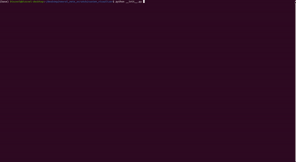

# Learning Neural Networks From Scratch
## Overview
While experimenting with Reinforcement Learning, I wanted to move onto Deep Q-Learning. However I had always wondered what were the inner workings of Neural Networks, which sparked interests in this project.

## References 
* Original Project and credits to [johanoxenstierna](https://github.com/johanoxenstierna/PythonPyQtANN) 
* Tutorial by [johanoxenstierna](https://www.youtube.com/watch?v=0f2QduIyqRo&list=PLejoaxbYaoffRE1qES0T45QIkocX82Xfy&index=1) 
* Learned some Mathematical concepts from [Michael Nielsen](http://neuralnetworksanddeeplearning.com/)
* Library used for text-based UI [Blessed](https://github.com/jquast/blessed)
* Library used for terminal-based dashboard [FedericoCeratto](https://github.com/FedericoCeratto/dashing)

## In Detail
Code is credited to [johanoxenstierna](https://github.com/johanoxenstierna/PythonPyQtANN) some minor edits to the code for the purpose of the UI

This network solves the **XOR** (exclusive or) problem 

Neural Network architecture is broken down into 3 python files:
* **Neuron.py**: where there's an **input and output, indexing** to refer to specific neurons within each layer
* **Layer.py**: an array to contain all neurons to their appropriate layer index
* **Net.py**: within the file **Synapse** for connections between Neurons

Training data (training_data.txt):
```
In; 1; 1; Expected; 0
In; 1; 0; Expected; 1
In; 0; 1; Expected; 1
In; 0; 0; Expected; 0
```
Below is sequentially called in the **__init__** method 
### Building the layer
```python
    # From Net.py
    def build_all_layers_and_neurons(self):
        self.layers.append(Layer())
        
        # Without the random weight initialization
        # Layer 0
        self.layers[0].add_neuron_to_layer(Neuron(0, 0.000, 0.000))
        self.layers[0].add_neuron_to_layer(Neuron(1, 0.000, 0.000))
        # bias
        self.layers[0].add_neuron_to_layer(Neuron(2, 0.000, 1.0)) 

        # Layer 1
        self.layers.append(Layer())
        self.layers[1].add_neuron_to_layer(Neuron(0, 0.000, 0.000))
        self.layers[1].add_neuron_to_layer(Neuron(1, 0.000, 0.000))
        self.layers[1].add_neuron_to_layer(Neuron(2, 0.000, 0.000))
        self.layers[1].add_neuron_to_layer(Neuron(3, 0.000, 0.000))
        # bias 
        self.layers[1].add_neuron_to_layer(Neuron(4, 0.000, 1.0))

         # Layer 2
        self.layers.append(Layer())
        self.layers[2].add_neuron_to_layer(Neuron(0, 0.000, 0.000))
        # bias
        self.layers[2].add_neuron_to_layer(Neuron(1, 0.000, 0.000))
```
### Building the Synapses
```python
    # Within Net.py
    # Synapse class
    def __init__(self, weight, neuron_left, neuron_right):
        self.weight = weight
        self.deltaweight = 0.000
        self.batch_deltaweight = 0.000
        self.neuron_left = neuron_left
        self.neuron_right = neuron_right
        self.__str__()
```        

```python
    def build_all_synapses(self):
    
        # referring first index is 0
        # including the bias 
        # ==========Layer 0==========
        for i in range(0,3):
            nl0 = self.get_neuron(0, i) # layer index, neuron index
            
            # not including bias
            # ==========Layer 1========== 
            for j in range(0,4):
                nl1 = self.get_neuron(1, j)
                self.synapsesL0L1[i,j] = Synapse(self.initial_weight_vals, nl0, nl1) # weight, left neuron, right neuron
        
        # including bias
        # ==========Layer 1==========   
        for i in range(0,5):
            nl1 = self.get_neuron(1,i)
            
            # output layer
            # ==========Layer 2========== 
            for j in range(0,1):
                nl2 = self.get_neuron(2,j)                
                self.synapsesL1L2[i, j] = Synapse(self.initial_weight_vals, nl1, nl2) 
```                
### Intializing Random Weights
```python
def initialize_weights(self):
        """
        referring to sigmoid function 
        x axis between -2,2 are the most active 
        which will increase the chance of improving weights
        closer to 0 will make the network difficult to do division 
        and assign takes to different neuron
        """
        # ==========Layer 0 to Layer 1 Random Weight Synapse==========
        # L0L1
        for i in range(0,3):
            for j in range(0,4):
                rand_weight = random.uniform(-2,2)
                setattr(self.synapsesL0L1[i,j], 'weight', rand_weight)


        # ==========Layer 1 to Layer 2 Random Weight Synapse==========
        # include layer 1 bias
        for i in range(0,5):
            rand_weight = random.uniform(-2,2)
            setattr(self.synapsesL1L2[i,0], 'weight', rand_weight)

```            
### Visualizing the Architecture
The result after the procedures above from console
```
==========Layer 0 to Layer 1 Synapse==========
Synapse(weight:0.01, left:Neuron(i:0, input:0.0, output:0.0), right:Neuron(i:0, input:0.0, output:0.0)
Synapse(weight:0.01, left:Neuron(i:0, input:0.0, output:0.0), right:Neuron(i:1, input:0.0, output:0.0)
Synapse(weight:0.01, left:Neuron(i:0, input:0.0, output:0.0), right:Neuron(i:2, input:0.0, output:0.0)
Synapse(weight:0.01, left:Neuron(i:0, input:0.0, output:0.0), right:Neuron(i:3, input:0.0, output:0.0)
Synapse(weight:0.01, left:Neuron(i:1, input:0.0, output:0.0), right:Neuron(i:0, input:0.0, output:0.0)
Synapse(weight:0.01, left:Neuron(i:1, input:0.0, output:0.0), right:Neuron(i:1, input:0.0, output:0.0)
Synapse(weight:0.01, left:Neuron(i:1, input:0.0, output:0.0), right:Neuron(i:2, input:0.0, output:0.0)
Synapse(weight:0.01, left:Neuron(i:1, input:0.0, output:0.0), right:Neuron(i:3, input:0.0, output:0.0)
Synapse(weight:0.01, left:Neuron(i:2, input:0.0, output:1.0), right:Neuron(i:0, input:0.0, output:0.0)
Synapse(weight:0.01, left:Neuron(i:2, input:0.0, output:1.0), right:Neuron(i:1, input:0.0, output:0.0)
Synapse(weight:0.01, left:Neuron(i:2, input:0.0, output:1.0), right:Neuron(i:2, input:0.0, output:0.0)
Synapse(weight:0.01, left:Neuron(i:2, input:0.0, output:1.0), right:Neuron(i:3, input:0.0, output:0.0)

==========Layer 1 to Layer 2 Synapse==========
Synapse(weight:0.01, left:Neuron(i:0, input:0.0, output:0.0), right:Neuron(i:0, input:0.0, output:0.0)
Synapse(weight:0.01, left:Neuron(i:1, input:0.0, output:0.0), right:Neuron(i:0, input:0.0, output:0.0)
Synapse(weight:0.01, left:Neuron(i:2, input:0.0, output:0.0), right:Neuron(i:0, input:0.0, output:0.0)
Synapse(weight:0.01, left:Neuron(i:3, input:0.0, output:0.0), right:Neuron(i:0, input:0.0, output:0.0)
Synapse(weight:0.01, left:Neuron(i:4, input:0.0, output:1.0), right:Neuron(i:0, input:0.0, output:0.0)

==========Layer 1 to Layer 2 Random Weight Synapse==========
Synapse(weight:1.3385608979499337, left:Neuron(i:0, input:0.0, output:0.0), right:Neuron(i:0, input:0.0, output:0.0)
Synapse(weight:1.9486410640937755, left:Neuron(i:0, input:0.0, output:0.0), right:Neuron(i:1, input:0.0, output:0.0)
Synapse(weight:1.019903860730213, left:Neuron(i:0, input:0.0, output:0.0), right:Neuron(i:2, input:0.0, output:0.0)
Synapse(weight:0.06242225191636752, left:Neuron(i:0, input:0.0, output:0.0), right:Neuron(i:3, input:0.0, output:0.0)
Synapse(weight:1.1356001479857465, left:Neuron(i:1, input:0.0, output:0.0), right:Neuron(i:0, input:0.0, output:0.0)
Synapse(weight:-1.7617531099067953, left:Neuron(i:1, input:0.0, output:0.0), right:Neuron(i:1, input:0.0, output:0.0)
Synapse(weight:-1.6303722035280637, left:Neuron(i:1, input:0.0, output:0.0), right:Neuron(i:2, input:0.0, output:0.0)
Synapse(weight:0.6573693646830083, left:Neuron(i:1, input:0.0, output:0.0), right:Neuron(i:3, input:0.0, output:0.0)
Synapse(weight:-1.5729785754571353, left:Neuron(i:2, input:0.0, output:1.0), right:Neuron(i:0, input:0.0, output:0.0)
Synapse(weight:-0.2743748196686795, left:Neuron(i:2, input:0.0, output:1.0), right:Neuron(i:1, input:0.0, output:0.0)
Synapse(weight:-1.5689248291874707, left:Neuron(i:2, input:0.0, output:1.0), right:Neuron(i:2, input:0.0, output:0.0)
Synapse(weight:0.07157810435244416, left:Neuron(i:2, input:0.0, output:1.0), right:Neuron(i:3, input:0.0, output:0.0)

==========Layer 2 to Layer 3 Random Weight Synapse==========
Synapse(weight:0.3902612716395297, left:Neuron(i:0, input:0.0, output:0.0), right:Neuron(i:0, input:0.0, output:0.0)
Synapse(weight:0.9984266196594849, left:Neuron(i:1, input:0.0, output:0.0), right:Neuron(i:0, input:0.0, output:0.0)
Synapse(weight:-1.9686633285268433, left:Neuron(i:2, input:0.0, output:0.0), right:Neuron(i:0, input:0.0, output:0.0)
Synapse(weight:-0.5302873049004555, left:Neuron(i:3, input:0.0, output:0.0), right:Neuron(i:0, input:0.0, output:0.0)
Synapse(weight:0.7409768247285551, left:Neuron(i:4, input:0.0, output:1.0), right:Neuron(i:0, input:0.0, output:0.0)
```
#### Drawing Out The Network
```
┌───    Network Display    ─────────────────────────────────────────────────────────────────────────┐
│Layer 0    Layer 1     Layer 2                                                                     │
│------     -----                                                                                   │
│|_0_|------|_0_|- -                                                                                │
│----- - -  -----    -  -----     Expected Output                                                   │
│|_1_|------|_1_|-------|_0_|-------> 0 or 1                                                        │
│-----  - - -----  -  - -----                                                                       │
│|_B_|------|_2_|-   -  |_B_|                                                                       │
│       - - ----- - -                                                                               │
│       -  -|_3_|- -                                                                                │
│        -  ----- -                                                                                 │
│          -|_B_|-                                                                                  │
└───────────────────────────────────────────────────────────────────────────────────────────────────┘
```
## Integrating the UI


Although the tutorial did provide a GUI, the custom UI was soley for the purpose of how the network processes data while running. 

Breakdown of the UI:

* **Network Display**: displaying the network architecture and the hyperparameters
* **Training Data**: shows what the network is reading during the iteration of each data row
* **Epoch, MSE, Output, Expected**: per epoch, the error, what the output is, and the expected output
* **Epochs**: progress bar, would be able to quit anytime with keyboard command **Q**, the program will end once the progress bar reaches to its max
* **Layer 0 to Layer 1 (Delta, Batch Delta Weight)** and **Layer 1 to Layer 2 (Delta, Batch Delta Weight)**: shows weight data of which synpases has a large negative effect 

The speed of the program can be adjusted in the **terminal inkey(timeout=)** of **__init__.py**:
```python
# snippet of the UI
with term.cbreak():
        while val.lower() != 'q':
            val = term.inkey(timeout=0.15)  # ---> default speed of 15 seconds
            if not val:                
                net.run_epoch()
                data.append(f"     {net.epoch}    |        {net.MSE}    |            {net.output_}    |           {net.expected_value}")
                train_data.append(f"{net.training_data.next_line}")
                l0l1_log.append(f"{net.delta_printL0L1()}")
                l1l2_log.append(f"{net.delta_printL1L2()}")
                ui.items[0].items[3].value = int(100 * math.sin(net.epoch / 100.0))
                ui.display()
            
            if ui.items[0].items[3].value == 99:
                print('Max epoch reached')
                break
```                

## Conclusion
***NOTE: There are mistakes in which the same epoch outputs multiple times with different results, which I cannot find out why.***

This approach may seem unconventional but I enjoyed the learning experiences and the challenges.

While doing this project, it makes me realize and appreciate the effort researchers put into developing various neural networks.
